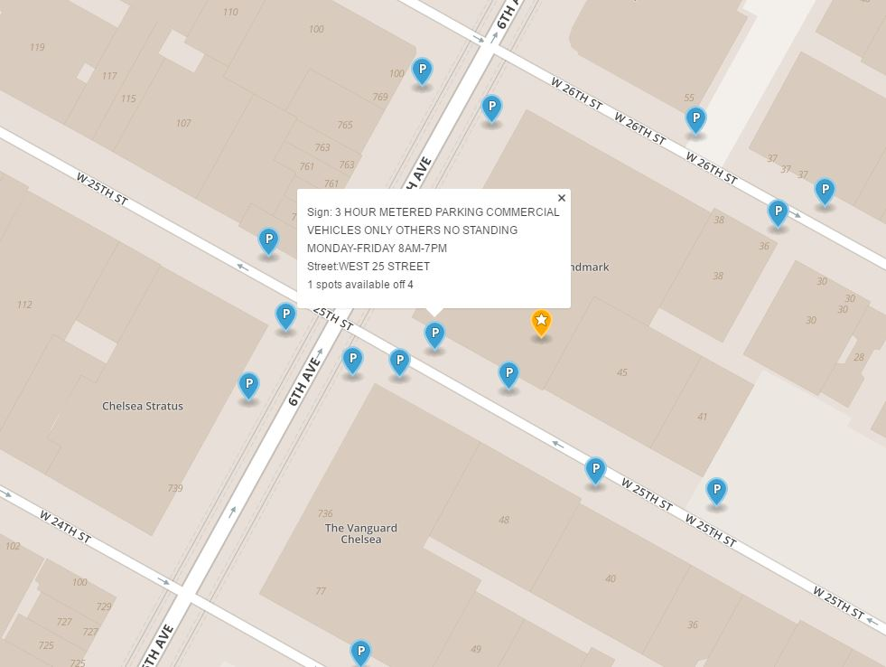

# ThatsMySpot - Real time parking finder
Data Engineering Project - Insight 2016 January

Time frame for project: 3 weeks

Thats my spot is an app that tracks availability of parking spots using geolocations and feedback from users. It is specifically implemented for New York, where there is no sensor data available and parking rules are quite complex. It recommends the closest available parking spots to a user according to their current location. It also allows them to remember where they parked and analyze their parking habits.

Demo website : http://thatsmyspot.space

[Presentation](http://www.slideshare.net/ShashankSinghal9/shashank-singhal-insight-thats-my-spot)

#Technologies used
Language used: Python, Javascript
 
Geoquiries index: Elasticsearch
  
Datbase for realtime updates and historical statistics: Postgresql

#What does the project look like ?
![ThatsMySpot LandingPage] (images/homepage.JPG)

#Approach
NYC Department of Transportation provides data about parksigns in New York. Using that data and assuming an average length a car would take I calculated the number of parking spots that a street would have. The complexity lies in aggregating all parking rules that apply for a spot and classifying them accordingly.
As realtime data about car movements and user behavior is not available, I generated the data. 
The main challenge for this project was handling relatime reactive search queries about available parking spots.

I use Elasticsearch for distributed realtime geoqueries. Elasticsearch is built upon Lucene, which is primarily a text search index. Spatial search in Elasticsearch is implemented using prefix trees which basically breaks down geo location data into a tree structure based on Quad trees or GeoHashes. 
All realtime updates about parking spoots being occupied and released is handled by PostGreSQL. It also stores data about user behavior like searches. 

